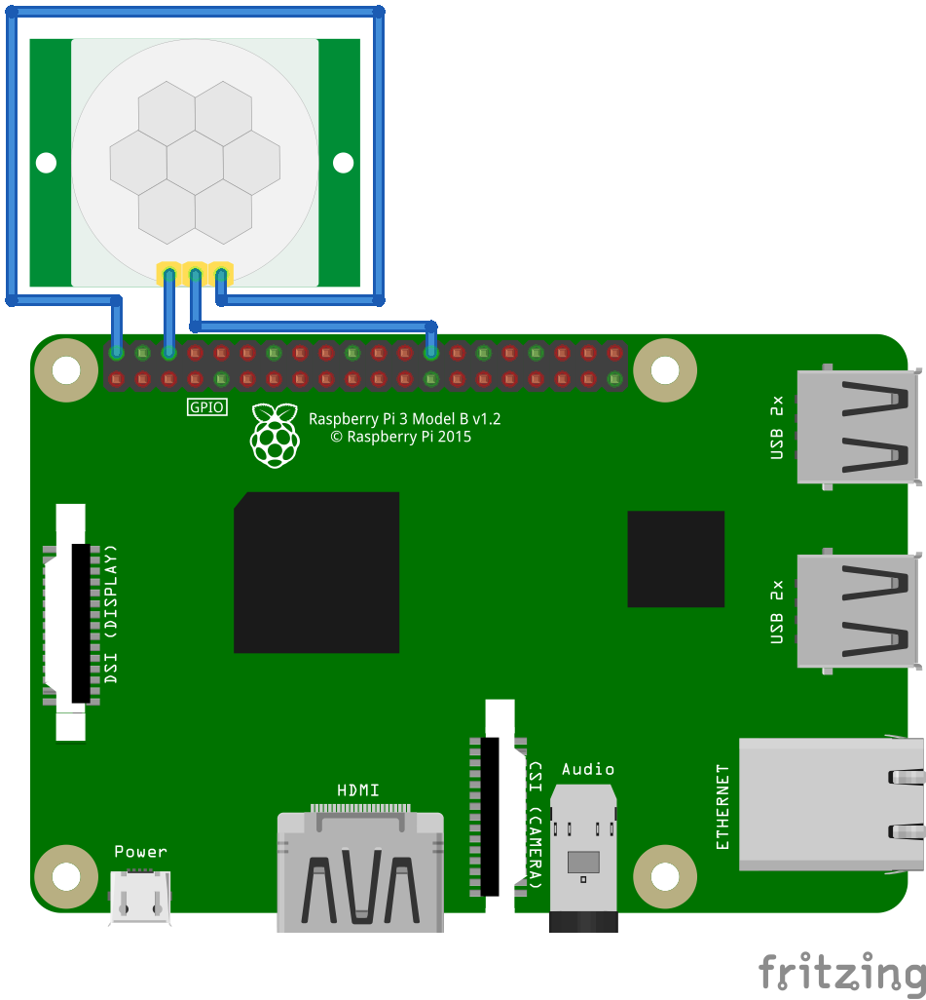

# MotionDetector

This is a project for motion detection with the raspberry pi and the motion senscor __HC-SR501__.

# Installation

If you want to install the motion detector on your raspberry pi you first have to connect your motion detector as in the image above. The HC-SR501 has a jumper for configuration between two modes. I chose the __L mode__, which means that when motion is detected the signal stays high (1) until there is no more detection.

After connecting your sensor you can turn on the rasperry pi, connect to it and type the following lines.

```bash
git clone https://github.com/deckersoftware/MotionDetector.git
cd MotionDetector
python3 main.py
```

Now your motion detection should be started with default configuration. If you like to end the the program just press _Ctrl + C_.

To automatically start the script after a reboot, you have to execute the following lines.

```bash
sudo ln -s `pwd`/motion_detector.service /etc/systemd/system/motion_detector.service
sudo systemctl enable motion_detector.service
sudo systemctl start motion_detector.service
```

# Configuration

In the __config.json__ file you can set the motion detection with the following parameters. The file is copied from the __config.json.sample__ file at the first start of the program.

| Parameter                              | Description                                                  | Default                                                      |
| -------------------------------------- | ------------------------------------------------------------ | ------------------------------------------------------------ |
| motion_input_pin                       | Defines the pin where the motion detector is connected to the raspberry pi | 7                                                            |
| motion_detected_duration_in_seconds    | Defines duration before __no_motion_action__ is executed     | 30                                                           |
| no_motion_detected_duration_in_seconds | Defines duration until __motion_action__ is executed         | 6                                                            |
| no_motion_action                       | Defines action when there is no motion detected. For example turn of the display | vcgencmd display_power 0                                     |
| motion_action                          | Defines action when there is motion detected. For example turn on the display | vcgencmd display_power 1                                     |
| motion_detection_time                  | Defines the time when the motion detection is activated. For example every day from 5 o'clock till 21 o'clock. | {"monday": "5:00 21:00", "tuesday": "5:00 21:00", "wednesday": "5:00 21:00", "thursday": "5:00 21:00", "friday": "5:00 21:00", "saturday": "5:00 21:00", "sunday": "5:00 21:00" } |

 # HC-SR501

The motion detection sensor has two potentiometers. One of them is for the time adjust delay which is configurable between 5 and 300 seconds, the other one is for the sensitivity. I set the first one to 5 seconds which explains the 6 seconds _no_motion_detected_duration_in_seconds_ configuration. When there is still motion after 6 seconds I would like to execute the motion action. Otherwise, nothing should happen.